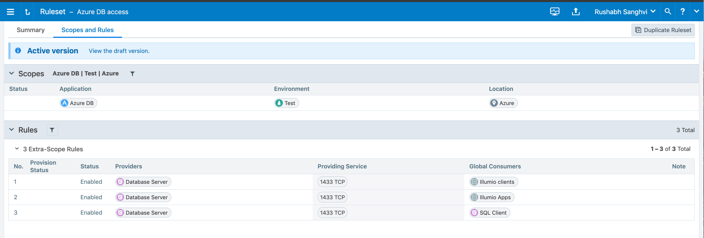
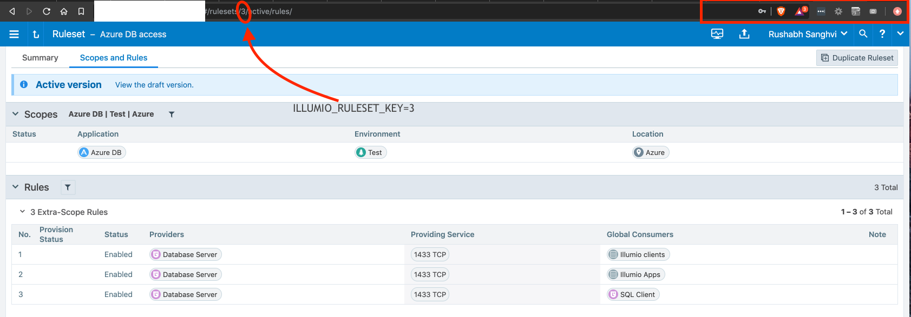

For our Illumio enforcer script to work, we would need the programming capabilities of Illumio ASP and Azure. Lets go over the configuration needed for both Illumio and Azure

## Configuration

### Illumio ASP Configuration
   1. We would need API credentials from Illumio ASP for the enforcer to make the REST API call.
   1. You could get this information from the PCE UI. Follow the below steps to generate the credentials for the Illumio enforcer.
   1. We will need these credentials later
      1. Login to PCE web UI.
      1. From top right, click your login name.
      1. Click My API Keys.
      1. Click Add from the top.
      1. Fill in the form and click save to generate the credentials.
      1. Download the credentials as this is the only time you will be able to download the credentials.
   1. We will create an Illumio Unmanaged workload for every Azure MS SQL database server we would like to enforce the segmentation policies for.
   1. Populate the unmanaged workload with the full FQDN of the SQL database server and IP address information which can be obtained from Azure
   1. You could look for the steps to create unmanaged workload from Illumio ASP “PCE Web Console Users Guide”.
   Link to documentation page here https://support.illumio.com/public/documentation/index.html
   1. Also, create a ruleset as shown in the image below. This script is configured to work with the following ruleset only.
   If you modify the ruleset, change the script code to parse the new ruleset accordingly.

       

### Azure Configuration
   1. On your local system, install azure cli using the steps from this link https://docs.microsoft.com/en-us/cli/azure/install-azure-cli-yum?view=azure-cli-latest
   1. Once the CLI is installed, get the subscription ID which will be listed as id in the output of the the following command
      ```
      az account list
      ```
   1. Once the subscription id is obtained, run the following command by replacing <subscription-id> with the id obtained in the above step
      ```
      az ad sp create-for-rbac --role="Contributor" --scopes="/subscriptions/<subscription-id>"
      ```
            1. appId will be used as AZURE_CLIENT_ID
            1. password will be used as AZURE_CLIENT_SECRET
            1. tenant will be used as AZURE_TENANT_ID
            1. subsciption-id will be used as AZURE_SUBSCRIPTION_ID

   1. Store these credentials. They will be used in the Installation section below

## Dependencies

The requirements for this project are recorded in requirements.txt file and need to be installed as explained
in the Installation section below.

## Installation

1. Clone the repo and enter the directory
```bash
git clone https://github.com/illumiolabs/azure-ms-sql-illumio-enforcer.git
cd azure-ms-sql-illumio-enforcer
```
1. Create a virtual environment with python 3.9 on a Linux machine in AWS.
```bash
python3 -m venv venv
source venv/bin/activate
```
1. Once the virtual environment is setup, install the requirements for the package using the following command in the virtual environment
 ```bash
 pip3 install -r src/requirements.txt
 ```
1. Obtain the Illumio ruleset key for the Azure MS SQL segmentation ruleset from the PCE as shown below

      

1. Setup the environment variables with the Illumio PCE API and Azure configuration information:
   ```bash
   export AZURE_SUBSCRIPTION_ID="obtained from above section"
   export AZURE_CLIENT_ID="appId in above section"
   export AZURE_CLIENT_SECRET="password from above section"
   export AZURE_TENANT_ID="tenant from above section"
   export RESOURCE_GROUP='resource group of the Azure MS SQL database'
   export ILO_API_VERSION=2
   # Replace PCE-URL with the PCE hostname in your deployment without the https
   export ILLUMIO_SERVER=<PCE-URL>
   export ILO_API_KEY_ID=<API-KEY-ID>
   export ILO_ORG_ID=<ORG ID>
   export ILO_PORT=<PCE Port>
   export ILO_API_KEY_SECRET=<API-KEY-SECRET>
   export ILLUMIO_RULESET_KEY=<key to be obtained as shown above>
   export POLL_TIMER=600
   ```
1. Run the following command to configure Azure SQL firewall from PCE ruleset:
   ```bash
   python3 src/create_sql_fw_rule.py
   ```
