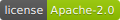
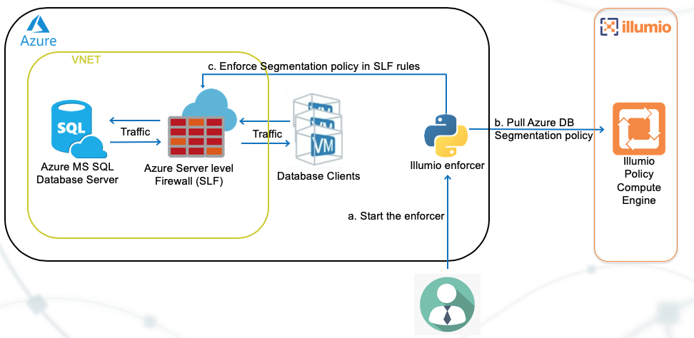

# Enforcing Illumio segmentation policies for Azure MS SQL Database server

**Project Description**

This repository contains a python script that will  
1. Ingest Illumio Segmentation policy ruleset for Azure SQL database server
1. Creates rules for the database server
1. Programs the server level firewall for the Azure SQL database server

Illumio ASP builds the Application Dependency Map that helps visualize the traffic between 
Azure instances including unmanaged Azure SQL database server and in understanding the application dependencies. 
It also enforces the segmentation policy and uses that to color the Application Dependency Map

**Project Technology stack** 

This project uses the python3.6 runtime

**Project workflow** 

## Installation

Detailed instructions on how to install, configure, and get the project running are mentioned 
in [INSTALL](INSTALL.md) document.

## Support

The AWS Lambda Function is released and distributed as open source software subject to the [LICENSE](LICENSE). 
Illumio has no obligation or responsibility related to the AWS Lambda Function with respect to support, maintenance, availability, security or otherwise. 
Please read the entire [LICENSE](LICENSE) for additional information regarding the permissions and limitations. 
You can engage with the author & contributors team and community on SLACK.

## Help or Docs 

If you have questions, please use slack for asking them.
If you have issues, bug reports, etc, please file an issue in this repository's Issue Tracker.

## Contributing

Instructions on how to contribute:  [CONTRIBUTING](CONTRIBUTING.md).

## Links

 * Screencast showing the Lambda working https://labs.illumio.com
 * Illumio documentation page for configuring Illumio ASP https://support.illumio.com/public/documentation/index.html
